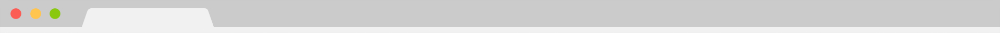
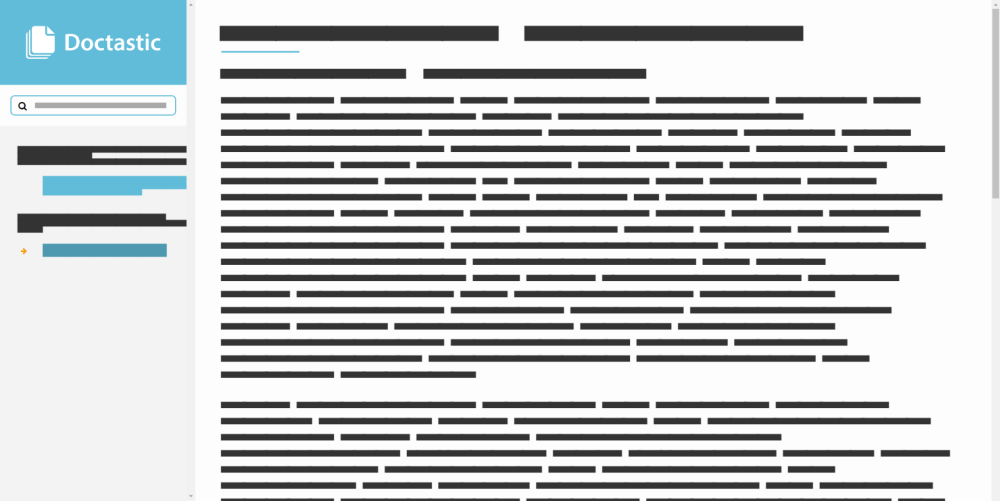

<section class="landingHero">
	

		<header>
			
			<ul class="buttons">
				<li><a href="#"><i class="fa fa-download"></i> Download</a></li>
				<li><a href="#"><i class="fa fa-file"></i> Docs</a></li>
			</ul>
		</header>
		

			<h2>Doctastic is a free and open-source Jekyll documentation theme.</h2>
		

		<footer>
			
			
			

		</footer>
	

</section>

<section class="additionalInfo">
	Doctastic was created by <a href="#">Matt Wilson</a>. &nbsp;Feel free to contribute on <a href="#">GitHub!</a>
</section>